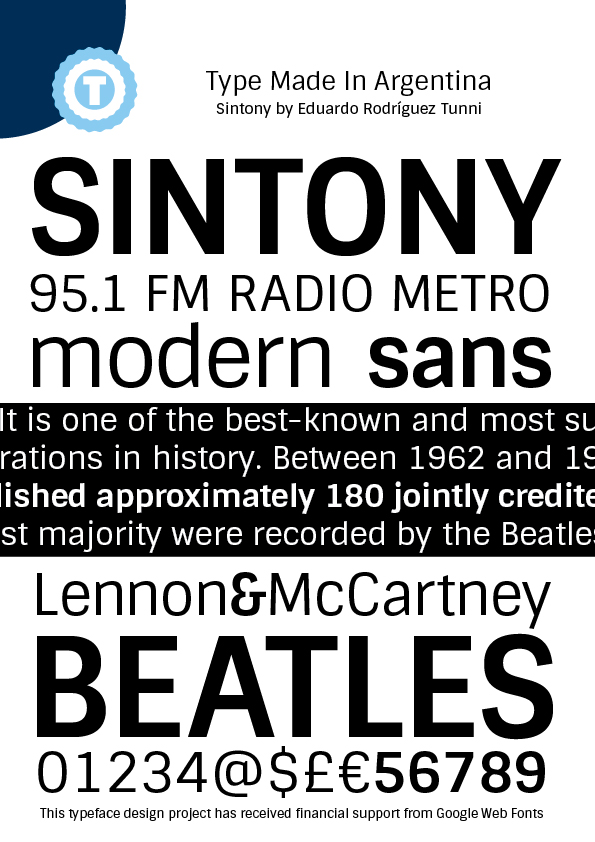

Sintony is a modern sans serif typeface, drawn with a slightly square structure and smooth stroke modulation. Great for long passages of text, he provides any text with a calm and clear feeling.

### Designer
Eduardo Rodríguez Tunni

### License
Licensed under the [*SIL Open Font License, 1.1*](http://scripts.sil.org/OFL); you may not use this file except in compliance with the License.

To contribute to the project contact Eduardo Rodríguez Tunni > edu@tipo.net.ar
